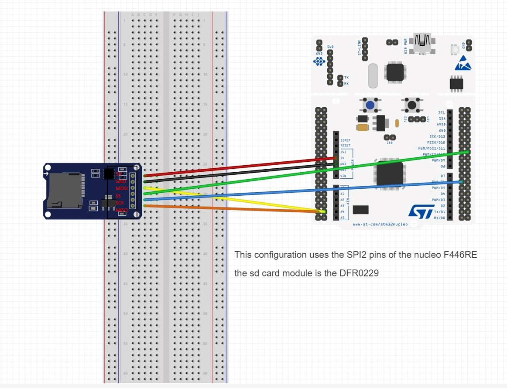

# SD Card Driver

From orbital 2023-2024 repo: [HERE](https://github.com/McGillRocketTeam/Orbital_2023-24_Payload/blob/sd_card_driver/main/SDCard_Driver/README.md)

## 1. Introduction

This is a SD Card driver. It is based on the [tutorial](https://01001000.xyz/2020-08-09-Tutorial-STM32CubeIDE-SD-card/) from Dr. Hammond Pearce. The SD Card driver is implemented using the [FatFs](http://elm-chan.org/fsw/ff/00index_e.html) library while communication with the SD Card is done using the SPI protocol.

It has been bonified with helper functions and configurations that allow:

- Easier writing to the SD Card
- Easier flushing of the SD Card
- Periodic flushing of the SD Card with the interrupt of timer 14

## 2. Setup and Connections

The SD card module is connected to the STM32 Nucleo board as follows:



Note that we are using the STM32F446RE Nucleo board, so the connections are made according to this board. If you are using another board, you should check the pinout and make the connections accordingly.

This implementation uses the SPI protocol for the communication between the STM32 Nucleo board and the SD card module DFR0229 from DFRobot.

In the ioc file, the SPI connection's pins are set as follows:


### 2.1. SD Card

The SD card should be formatted to MS-DOS (FAT32) format for its file system to be compatible with the current driver implementation.

Please note that according to the official [FatFs documentation](http://elm-chan.org/fsw/ff/doc/appnote.html), the following are the limitations of the FAT file system:

- Number of open files: Unlimited. (depends on available memory)
- Number of volumes: Up to 10.
- Sector size: 512, 1024, 2048 and 4096 bytes.
- Minimum volume size: 128 sectors.
- Maximum volume size: 2^32 - 1 sectors in 32-bit LBA.
- Maximum file size: 2^32 - 1 bytes on FAT volume.
- Cluster size: Upto 128 sectors on FAT volume.
- read/write performance will be improved by taking effort to sector align.

### 2.2. IOC

#### 2.2.1. Middleware

Include the FATFS middleware with `user-defined` mode.

#### 2.2.2. Clock and Timer Configurations

You may need to modify them according to your desired clock speeds. The following is used:

- HCLK: 72 MHz
  - The baud rate prescaler needs some adjusting according the selected clock speed. It is detailed in the following sections.
- TIM14 (following the [tutorial](https://www.digikey.ca/en/maker/projects/getting-started-with-stm32-timers-and-timer-interrupts/d08e6493cefa486fb1e79c43c0b08cc6) from DigiKey):
  - The timer will interrupt every 1 second
  - Do not forget to enable the timer global interrupt in the NVIC settings of the timer
  - 

#### 2.2.3. Connectivity

Set the   SPI connection to `Full-Duplex Master` with `Hardware NSS Output Signal`. Then set the Data Size to `8 bits`, and the clock prescaler to `128` if you are using a HCLK of `72 MHz`. Otherwise, the Baud Rate should be approximately `280 KBits/s`.


### 2.3. Files

Add the files `user_diskio_spi.c` and `user_diskio_spi.h` found under `FATFS/Target` into your own `FATFS/Target`. Also add `sdcard.h` and `sdcard.c`.

#### 2.3.1. user_diskio.c

Add lines according to:

```C
/* USER CODE BEGIN DECL */

/* Includes ------------------------------------------------------------------*/
#include <string.h>
#include "ff_gen_drv.h"
#include "user_diskio_spi.h"
```

```C
/* Private functions ---------------------------------------------------------*/

/**
  * @brief  Initializes a Drive
  * @param  pdrv: Physical drive number (0..)
  * @retval DSTATUS: Operation status
  */
DSTATUS USER_initialize (
  BYTE pdrv           /* Physical drive nmuber to identify the drive */
)
{
  /* USER CODE BEGIN INIT */
  return USER_SPI_initialize(pdrv); //ADD THIS LINE
  /* USER CODE END INIT */
}

/**
  * @brief  Gets Disk Status
  * @param  pdrv: Physical drive number (0..)
  * @retval DSTATUS: Operation status
  */
DSTATUS USER_status (
  BYTE pdrv       /* Physical drive number to identify the drive */
)
{
  /* USER CODE BEGIN STATUS */
  return USER_SPI_status(pdrv); //ADD THIS LINE
  /* USER CODE END STATUS */
}

/**
  * @brief  Reads Sector(s)
  * @param  pdrv: Physical drive number (0..)
  * @param  *buff: Data buffer to store read data
  * @param  sector: Sector address (LBA)
  * @param  count: Number of sectors to read (1..128)
  * @retval DRESULT: Operation result
  */
DRESULT USER_read (
  BYTE pdrv,      /* Physical drive nmuber to identify the drive */
  BYTE *buff,     /* Data buffer to store read data */
  DWORD sector,   /* Sector address in LBA */
  UINT count      /* Number of sectors to read */
)
{
  /* USER CODE BEGIN READ */
  return USER_SPI_read(pdrv, buff, sector, count); //ADD THIS LINE
  /* USER CODE END READ */
}

/**
  * @brief  Writes Sector(s)
  * @param  pdrv: Physical drive number (0..)
  * @param  *buff: Data to be written
  * @param  sector: Sector address (LBA)
  * @param  count: Number of sectors to write (1..128)
  * @retval DRESULT: Operation result
  */
#if _USE_WRITE == 1
DRESULT USER_write (
  BYTE pdrv,          /* Physical drive nmuber to identify the drive */
  const BYTE *buff,   /* Data to be written */
  DWORD sector,       /* Sector address in LBA */
  UINT count          /* Number of sectors to write */
)
{
  /* USER CODE BEGIN WRITE */
  /* USER CODE HERE */
  return USER_SPI_write(pdrv, buff, sector, count); //ADD THIS LINE
  /* USER CODE END WRITE */
}
#endif /* _USE_WRITE == 1 */

/**
  * @brief  I/O control operation
  * @param  pdrv: Physical drive number (0..)
  * @param  cmd: Control code
  * @param  *buff: Buffer to send/receive control data
  * @retval DRESULT: Operation result
  */
#if _USE_IOCTL == 1
DRESULT USER_ioctl (
  BYTE pdrv,      /* Physical drive nmuber (0..) */
  BYTE cmd,       /* Control code */
  void *buff      /* Buffer to send/receive control data */
)
{
  /* USER CODE BEGIN IOCTL */
  return USER_SPI_ioctl(pdrv, cmd, buff); //ADD THIS LINE
  /* USER CODE END IOCTL */
}
#endif /* _USE_IOCTL == 1 */
```

#### 2.3.2. user_diskio_spi.c

Modify the lines defining `FCLK_SLOW` and `FCLK_FAST`. You can use the baud rate prescaler in the ioc shown in section _2.2.3._ to calculate the needed values.

Note that you only need to modify the second `SPI_BAUDRATEPRESCALER` values since the first one is set to 256 to serve as mask to clear the prescaler bits.

**Example:**

for a HCLK of 72 MHz, the baud rate prescaler is set to 128 for slow and 8 for fast.

```C
#define FCLK_SLOW() { MODIFY_REG(SD_SPI_HANDLE.Instance->CR1, SPI_BAUDRATEPRESCALER_256, SPI_BAUDRATEPRESCALER_128); }  /* Set SCLK = slow, approx 280 KBits/s*/
#define FCLK_FAST() { MODIFY_REG(SD_SPI_HANDLE.Instance->CR1, SPI_BAUDRATEPRESCALER_256, SPI_BAUDRATEPRESCALER_8); }  /* Set SCLK = fast, approx 4.5 MBits/s */
```

for a HCLK of 180 MHz, the baud rate prescaler is set to 256 for slow and 16 for fast.

```C
#define FCLK_SLOW() { MODIFY_REG(SD_SPI_HANDLE.Instance->CR1, SPI_BAUDRATEPRESCALER_256, SPI_BAUDRATEPRESCALER_256); }  /* Set SCLK = slow, approx 280 KBits/s*/
#define FCLK_FAST() { MODIFY_REG(SD_SPI_HANDLE.Instance->CR1, SPI_BAUDRATEPRESCALER_256, SPI_BAUDRATEPRESCALER_16); }  /* Set SCLK = fast, approx 4.5 MBits/s */
```

#### 2.3.3. main.h

Add lines according to:

```C
/* USER CODE BEGIN EFP */
void myprintf(const char *fmt, ...);
/* USER CODE END EFP */
```

```C
/* USER CODE BEGIN Private defines */
#define SD_SPI_HANDLE hspi2 // change to the spi connection you use
/* USER CODE END Private defines */
```

## 3. Description

Inside `sd_card_testing.c`, you can find the functions used to test the SD Card driver. For more information on the testing done and how to test, please refer to the [testing documentation](https://docs.google.com/document/d/1JLyP9ziIrILuKhOz4wkJpDOfKrk5nyXLULKBz46mjos/edit?usp=sharing).

Inside `sdcard.c`, you can find the helper functions:

- `myprintf`: Used to print information to the serial monitor.
- `SDCard_file_write`: Used to write to a file on the SD Card.
- `SDCard_file_flush_line_check`: Used to flush the file on the SD Card while checking if more than `SD_FLUSH_LINE_SIZE` lines have been written to the file since the last flush.
- `HAL_TIM_PeriodElapsedCallback`: Callback function that is called when the timer 14 interrupt is triggered. With the current configuration, it is triggered every 1 second. The file is flushed on the SD card whenever the file has been modified and `SD_FLUSH_TIME_FREQ_SEC` seconds have passed since the last flush.

As reference on how to use the drivers and the helper functions and what to `#include`, you can refer to the initialization in `main.c` and the testing in `sd_card_testing.c`.

## 4. Miscellaneous Edge Cases Resolved During Development

### 4.1. myprintf

For the `myprintf` function to work with float numbers, you need to enable `-u _printf_float` in the `Project Properties`. Otherwise, you will get the error

> The float formatting support is not enabled, check your MCU Settings from "Project Properties > C/C++ Build > Settings > Tool Settings", or add manually "-u _printf_float" in linker flags.


Please note that the UART/USART associated with `myprintf` (see `huart[X]` in `myprintf` function) must be enabled at a baud rate of 115200.

### 4.2. Mounting the SD Card

The `FR_NOT_READY (3)` error during the mounting of the SD card can be caused by various reasons. It is not very descriptive, so it is hard to know what is actually causing the error. The following are some of the reasons that can cause the error:

- The SD card is not properly connected to the SPI pins.
- The SD card is not properly formatted.
- The baud rate prescaler is not properly set.
- The GPIO Pull-up/Pull-down settings of the SPI pins might need to be adjusted (see [here](https://github.com/kiwih/cubeide-sd-card/issues/2)).
